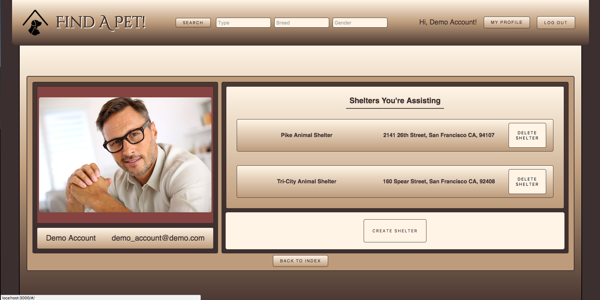
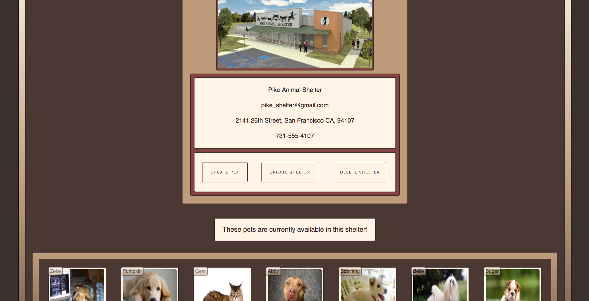
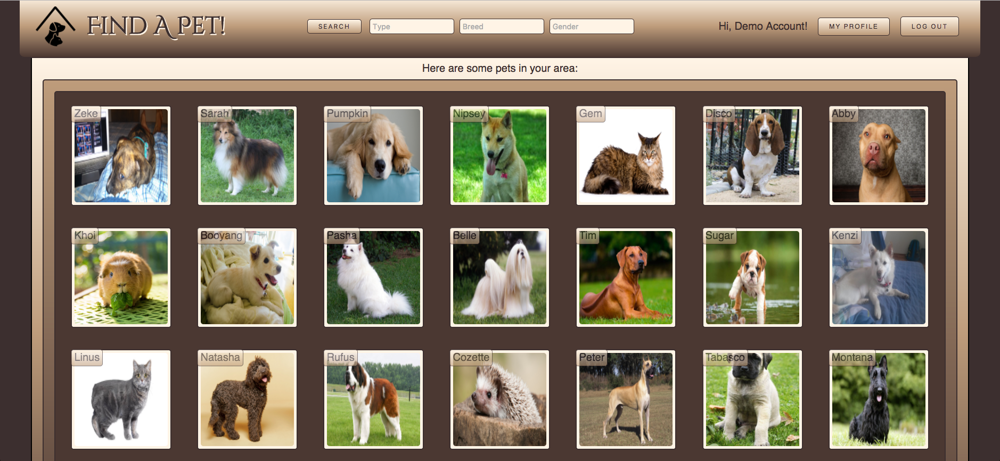
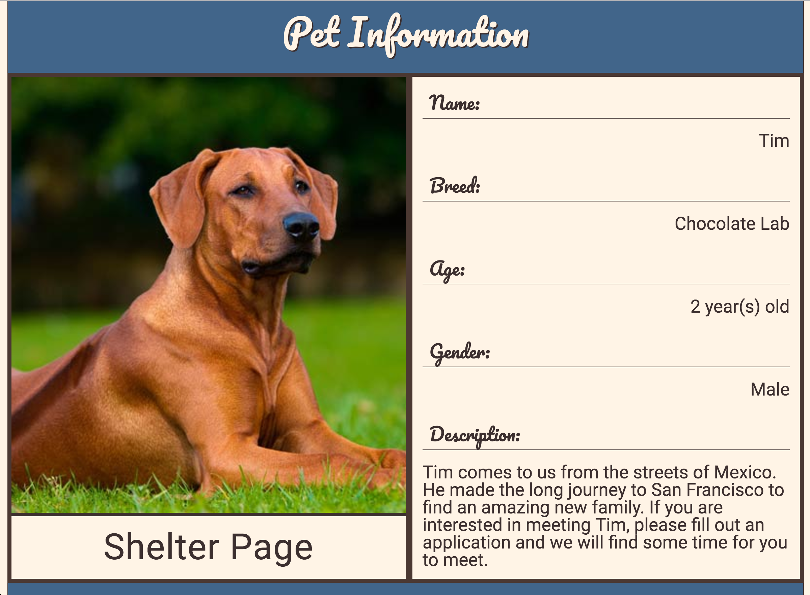
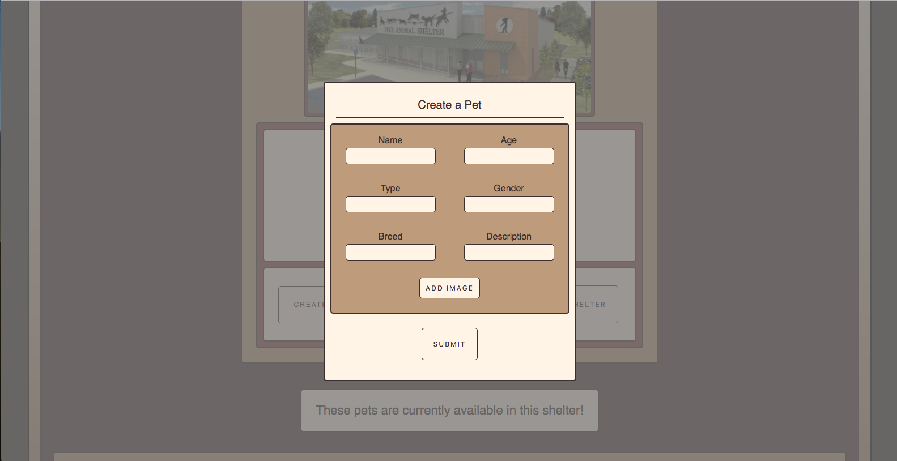

#Find-A-Pet!

[Find-A-Pet! live][findapet]

Find-A-Pet is a full-stack web application inspired by PetFinder. It utilizes a Ruby on Rails backend, a PostgreSQL database, and a React / Redux front end.

Please see the [docs][docs] folder for design documentation.

## Features & Implementation

### Users

This website was designed around the idea of having as few steps as possible between the user navigating to the website and adopting with a pet. Therefore, the database schema and user authorization is purposefully kept to a minimum. The only important (and therefore required) columns on the users table are `username` and `email`. A hand-rolled user authentication system is in place on both the frontend and the backend.

A list of users is stored in the Redux state as an object with the `id` field as the key for each user. `Session` is stored in the state as well. It is important for the `session` components' states to hold user information, however since the website's primary focus is pet adoption the `user` component is not rendered elsewhere.

<p align="center">
  
</p>

### Shelters

If a user chooses, he or she can create a `shelter` profile. A `shelter` profile includes functionality to create, update, and delete `pets`. There are unique database constraints on the physical address and email address of the shelter.

A list of shelters is stored in the state as an object with the `id` field as the key for each shelter. Shelters are rendered in two different components:

* `ShelterIndex`: This component is displayed on the user's profile page. It renders as a filtered index of shelters that the user is working in conjunction with.

* `ShelterDetails`: This is displayed when the user clicks on a certain shelter in the `ShelterIndex` component. It displays the shelter's information along with buttons to create a pet, update the shelter information, or delete the shelter. It also renders the components `ShelterForm`, `PetIndex`, and `PetForm`.

<p align="center">
  
</p>

### Pets

Being the primary focus of the website, almost every component in some way interacts with the `Pet` class. `Pet` objects are dependent on `shelters`, and if a `shelter` is removed from the database, so are its `pets`.

A list of pets is stored in the state as an object with the `id` field as the key for each pet. Pets are rendered in three different components:

* `PetIndex`: This component is displayed as the website's homepage, on each shelter's page, and after a user searches for a pet through the `SearchBar`.

<p align="center">
  
</p>

* `PetDetails`: This is displayed when the user clicks on a certain pet in the `ShelterIndex` component. It displays the pet's basic information, along with a `PetForm`.

<p align="center">

</p>

* `PetForm`: This is displayed as a modal when the user would like to create a new pet profile, or would like to update a current pet's profile.

<p align="center">
  
</p>

### Search Bar

In order to allow users to quickly find the pet best suited for them, a search bar has been incorporated into the header. It has the ability to polyfill text fields based on a pet's type, breed, and gender. Incorporating the search bar proved to be tricky. The search bar is an entirely frontend component, but still needs its own route like a backend component. This was worked around by changing default manner in which the search bar handles a `submit` action. It adds the search parameters to the application's global state, and then manually redirects the user to the appropriate route via Javascript's `window.location=` method.

```javascript

  class SearchBar extends React.Component {

    constructor(props) {
      super(props);

      this.state = {
        pet_type: "",
        breed: "",
        gender: "",
      };

      this.handleSubmit = this.handleSubmit.bind(this);
    }

    handleSubmit(e) {
      e.preventDefault();
      this.props.search(this.state);
      window.location = "/#/search";
    }
    // ...
  }


```

## Future

There are several directions this project can take in the future, and several features that could be incorporated to improve overall user experience. The changes will happen in no specific order or timeline.

- Refactor the search bar's polyfill to filter subsequent categories after selection.

- Incorporate Google Map's API for shelter location maps.

- Include a user/shelter messaging system.

- Allow pets to have many photos.

[findapet]: http://findapet.herokuapp.com
[docs]: ./docs
[seeds]: ./db/seeds.rb
[cloudinary]: http://cloudinary.com/
